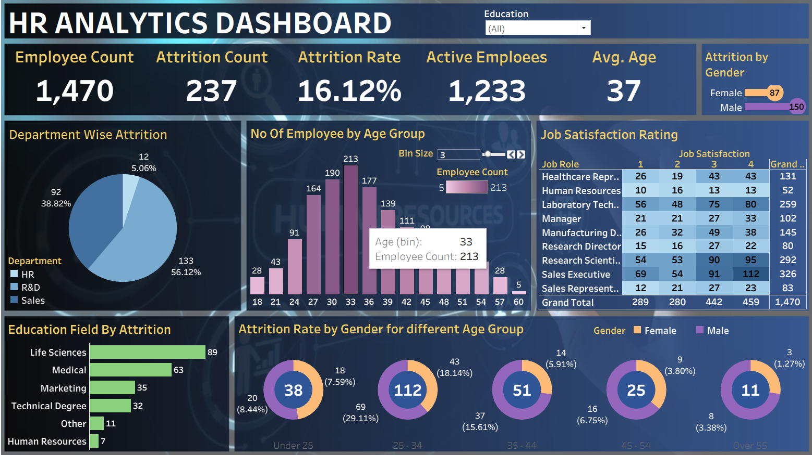

# 📊 HR Analytics Dashboard with QA Testing using PostgreSQL
# 📜 OBJECTIVE

Help an organization to improve employee performance and improve retention (reduce attrition) by creating an HR Analytics dashboard. This interactive dashboard provides valuable insights into various HR metrics and helps in analyzing employee attrition within the company. The objective is to assist HR professionals and management in making informed decisions based on the provided information. This project involvs the creation of an HR Database in PostgreSQL,crafting queries,and developing a quality assurance testing document to ensure the quality of the project.

# 👨‍💻 DESCRIPTION

Attrition analysis for employee departures involves investigating the reasons behind job exits. Factors like dissatisfaction, limited growth opportunities, work-life balance issues, and interpersonal challenges contribute to voluntary resignations. Understanding these drivers helps organizations implement targeted improvements and retention strategies to enhance the overall employee experience and reduce turnover.

# 📊 KEY PERFORMANCE INDICATORS (KPIs)

* Attrition Rate: The percentage of employees who have left the company within a specific period.
* Total Employees: The total number of employees in the company.
* Average Salary: The average salary of employees in the organization.
* Average Age: The average age of employees in the company.
* Years at Company: The average number of years employees have been with the company.

# 📈 DASHBOARD VISUALIZATIONS

1. Donut Chart: Displays attrition by gender and age gap, providing a visual comparison of attrition rates between male and female employees within the age gap.

2. Bar Graph: Illustrates attrition by age, highlighting the attrition rate for different age groups.

3. Heat Map: Shows job role satisfaction, indicating the level of satisfaction for different job roles within the company.

4. Clustered Bar Chart: Depicts attrition by Education background, showing the proportion of employees leaving based on their education level.

5. Pi Chart: Displays attrition by department, allowing comparison of attrition rates across different departments.

# ✨ INSIGHTS GENERATED :

## 1. Department Analysis:
By using the slicer filter for departments, you can analyze and compare various HR metrics across different departments. This helps identify departments with higher attrition rates, lower job satisfaction scores, or specific trends that require attention.

## 2. Attrition Patterns by Education Background:
The donut chart showcasing attrition by education background can reveal if certain education qualifications have a higher attrition rate. This insight can be used to identify potential issues related to specific education backgrounds and take appropriate actions.

## 3. Understanding Attrition by Age:
The column chart displaying attrition by age group enables you to identify any age-related trends in employee attrition. It helps to pinpoint age groups that may require special attention, such as identifying potential issues related to career progression or work-life balance.

## 4. Job Role Analysis:
The matrix presenting job roles, job satisfaction scores, and attrition status helps identify any specific job roles that experience higher attrition rates. This information can be used to assess factors such as workload, growth opportunities, or workplace culture that may impact employee retention.

## 5. Salary-Related Attrition:
The bar chart illustrating attrition by salary levels provides insights into whether there is a correlation between salary and attrition. It helps identify salary ranges where attrition is particularly high, which can inform compensation and benefits strategies to improve employee retention.

## 6. Attrition by Gender:
The tree chart depicting attrition by gender can highlight any gender-based attrition patterns within the organization. This insight can prompt a closer examination of potential issues related to diversity and inclusion, career development, or work environment that may affect employee retention.

# 🔄 QA Testing :

Created an HR Database in Postgre SQL, crafted SQL queries and created a quality assurance test document to ensure the quality of the dashboard.

* FUNCTIONAL VALIDATION: Test each feature work as per the requirement. To verify all the filters and Action Filters on the report work as per the requirement.
* DATA VALIDATION: Checked accuracy and quality of data in order To match the values in Power BI/Tableau report with SQL queries.
* TESTING REPORT : Created a Test document containing the screenshots and queries used to test the reports.

# 💼 TABLEAU DASHBOARD:

# 💼 POWER BI DASHBOARD:

